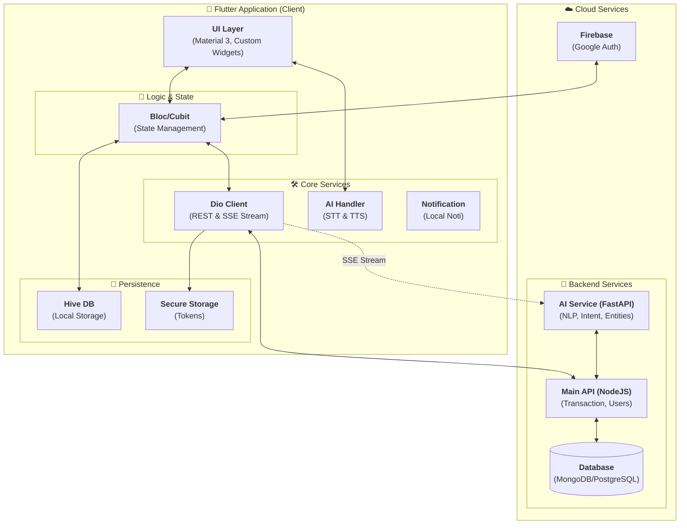

## 📱 Frontend (Flutter) - README-frontend.md

### 📦 Mô tả dự án

Ứng dụng Flutter giúp người dùng quản lý tài chính cá nhân. Cho phép đăng nhập bằng Google, tạo ví/tài khoản, ghi nhận thu chi, đặt ngân sách, theo dõi báo cáo. Hỗ trợ dùng offline (guest mode) và đồng bộ sau khi đăng nhập.
---

### 🌟 Chức năng chính của hệ thống

#### 1. Quản lý tài khoản & Ví (Account Management)
- **Đa dạng nguồn tiền**: Hỗ trợ tạo và quản lý nhiều loại tài khoản như Tiền mặt, Ngân hàng, Ví điện tử.
- **Tùy biến cá nhân**: Mỗi tài khoản có thể chọn biểu tượng, màu sắc và tên riêng biệt.
- **Theo dõi số dư**: Tự động tính toán và cập nhật số dư thực tế ngay sau mỗi giao dịch.

#### 2. Quản lý giao dịch (Transaction Tracking)
- **Ghi chép thu chi**: Nhập liệu nhanh chóng các khoản thu nhập và chi phí hàng ngày.
- **Phân loại thông minh**: Hệ thống danh mục đa dạng với icon sinh động, giúp dễ dàng phân loại mục đích chi tiêu.
- **Quản lý lịch sử**: Xem lại, chỉnh sửa hoặc xóa giao dịch dễ dàng. Khi thay đổi giao dịch, số dư tài khoản tương ứng sẽ tự động điều chỉnh chính xác.

#### 3. Trợ lý ảo AI (Voice-to-Transaction)
- **Nhập liệu bằng giọng nói**: Sử dụng công nghệ xử lý ngôn ngữ tự nhiên (NLP) để bóc tách thông tin từ tiếng Việt.
- **Tự động nhận diện**: AI tự động hiểu Số tiền, Hạng mục, Ghi chú và Ý định (Thu/Chi).
- **Phản hồi thông minh**: Trợ lý trò chuyện và phản hồi lại bằng giọng nói để xác nhận thông tin.
- **Chế độ rảnh tay**: Hỗ trợ thêm nhanh giao dịch mà không cần chạm vào màn hình.

#### 4. Báo cáo & Thống kê (Analytics)
- **Biểu đồ trực quan**: Theo dõi biến động thu chi qua biểu đồ đường (Line Chart) theo từng tháng.
- **Thống kê hạng mục**: Xem chi tiết phần trăm chi tiêu cho từng hạng mục để tối ưu hóa ngân sách.
- **Lọc linh hoạt**: Hỗ trợ xem báo cáo theo từng tài khoản riêng biệt hoặc tổng thể.

#### 5. Đồng bộ & Bảo mật (Sync & Security)
- **Đăng nhập Google**: Bảo mật và tiện lợi với cơ chế Firebase Auth.
- **Đồng bộ đám mây**: Tự động đồng bộ dữ liệu giữa nhiều thiết bị và bảo toàn dữ liệu khi cài lại app.
- **Chế độ Ngoại tuyến (Offline)**: Hoạt động hoàn hảo ngay cả khi không có mạng, dữ liệu sẽ được đồng bộ ngay khi có kết nối trở lại.

#### 6. Cá nhân hóa (Settings)
- **Đa ngôn ngữ**: Hỗ trợ Tiếng Việt, Tiếng Anh và nhiều ngôn ngữ khác.
- **Giao diện**: Tùy chỉnh chế độ Sáng/Tối (Light/Dark mode) và màu sắc chủ đạo.
- **Thông báo**: Nhắc nhở ghi chép chi tiêu hàng ngày để không bỏ lỡ giao dịch nào.

---

### 🤖 Tính năng AI Assistant (Tích hợp Trí tuệ nhân tạo)

Ứng dụng được tích hợp một trợ lý ảo thông minh, cho phép người dùng quản lý tài chính hoàn toàn bằng giọng nói. Đây không chỉ là một trình thu âm đơn thuần mà là một hệ thống xử lý ngôn ngữ tự nhiên (NLP) mạnh mẽ.

#### 🎙️ Các tính năng chính của AI:
1. **Nhận diện thực thể (Entity Recognition)**:
   - **Số tiền**: Tự động bóc tách số tiền từ câu nói (Ví dụ: "thêm một trăm nghìn cơm trưa" -> 100,000đ).
   - **Hạng mục**: Tự động phân loại giao dịch vào các nhóm như Ăn uống, Di chuyển, Mua sắm...
   - **Thời gian**: Hiểu các mốc thời gian tương đối như "hôm nay", "hôm qua", "thứ hai tuần trước".
   - **Ghi chú**: Tự động trích xuất nội dung mô tả giao dịch.
2. **Phân tích ý định (Intent Classification)**: Tự động phân biệt người dùng đang muốn nhập **Khoản chi (Expense)** hay **Khoản thu (Income)**.
3. **Phản hồi bằng giọng nói (Text-to-Speech)**: Trợ lý ảo phản hồi lại bằng giọng nói tiếng Việt để xác nhận thông tin hoặc thông báo kết quả.
4. **Luồng xác nhận thông minh (Smart Confirmation)**: 
   - Hỗ trợ hiển thị bảng xác nhận chi tiết trước khi ghi vào sổ cái.
   - Cơ chế xử lý bất đồng bộ: Ngay cả khi người dùng đóng cửa sổ lắng nghe, hệ thống vẫn tiếp tục xử lý và hiển thị bảng xác nhận khi AI có kết quả.

#### 🛠️ Công nghệ AI sử dụng:
- **Speech-to-Text (STT)**: Sử dụng gói `speech_to_text` hỗ trợ Tiếng Việt độ chính xác cao.
- **Server-Sent Events (SSE)**: Tích hợp Stream API để nhận phản hồi thời gian thực từ Backend AI (FastAPI/Python).
- **Text-to-Speech (TTS)**: Sử dụng `flutter_tts` cấu hình engine Google TTS cho giọng đọc tự nhiên.
- **Cấu hình**: Người dùng có thể tùy chỉnh **Tài khoản mặc định** cho AI và bật/tắt **Chế độ xác nhận** trong phần Cài đặt AI.

---
### 📱 Video demo & cài đặt ứng dụng
Video demo, file APK có sẵn tại đây:  
👉 [Google Drive](https://drive.google.com/drive/folders/1Fe48WZxZOVdHyJiVlq2p4rmDCrmMPfyp)
---
### Một số giao diện của hệ thống
<h2 align="center">📸 Screenshots</h2>

  
  
  
  

  
  
  
  

  
  
  
  

  
  

---
### 🚀 Công nghệ sử dụng

- Flutter 3.x
- Dio (API client)
- Firebase Auth (Google Sign-in)
- Bloc/Cubit (State management)
- Hive (dữ liệu offline, dữ liệu key value)
- Local Notification

---

### 📋 Yêu cầu hệ thống

- Flutter SDK 3.0.0 trở lên
- Dart 3.0.0 trở lên
- Android Studio / VS Code
- iOS Simulator (cho macOS) hoặc Android Emulator
- Node.js (cho backend development)

---

### 🏗️ Kiến trúc hệ thống

---

### 📱 Chức năng đã có

- [x] Google Sign-in + JWT
- [x] Quản lý trạng thái auth (cubit)
- [x] CRUD Account (hiện tại là thủ công)
- [x] Giao diện account + chi tiết + xoá/sửa
- [x] Transaction list + add
- [x] Categories CRUD
- [x] Dashboard báo cáo
- [x] Offline mode (guest)
- [x] Local Notification

- [x] AI Assistant (Hỗ trợ nhập liệu bằng giọng nói)
- [x] Tự động sync khi login lại

### 📞 Liên hệ

📌 Ghi chú:

- App hiện tại đang ở giai đoạn 1: CRUD + Auth
- Giai đoạn 2: ngân hàng, báo cáo nâng cao

